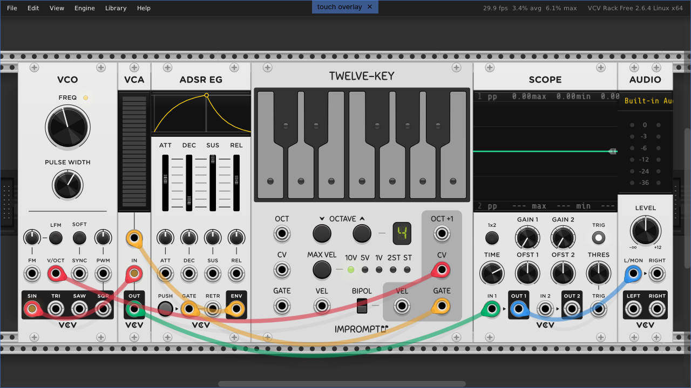

# Overview

This repo contains a simple application to be used with [VCV Rack 2](https://vcvrack.com/), and provides a minimal touch interface. It creates an overlay that consumes the touch events and forwards them to the VCV Rack application as keyboard/mouse actions (using Xlib).

**NOTE**: This app only works with GNU/Linux and X11 (not Wayland or other servers). It is free software, and is provided as is, without any warranty.



# Installation

Download this repo, open a terminal inside it and run the following command:

    ```
    make install-app DEST_DIR=XX RACK_SYSTEM_DIR=YY
    ```

Where XX is the directory where you want to install this app (it defaults to `/opt/vcv-to`), and YY is the path where you have installed VCV Rack 2 (it defaults to `/opt/Rack2Free`). If the default values are good for you, just remove them from the previous command.


# Configuration

In order to get the best results, I suggest you to setup VCV as follows:

- Mouse wheel: `zoom`
- Lock cursor while dragging: `false`
- Knob mode: `relative rotary`
- Control knobs with mouse wheel: `true`

Moreover, if you are using Gnome Shell, to avoid wasting vertical screen and keep the VCV menu, I recommend the installation of the [Unite extension](https://extensions.gnome.org/extension/1287/unite/), or something like that.

I also use [Touché](https://github.com/JoseExposito/touche) to setup a 3-finger tap that sends `F4`, so I can easily fit all modules on the screen.


# Working with Touch Overlay

When the application is enabled, it shows a thin blue border arond the screen, and a label in the middle of the top bar with the text "touch overlay", and an X button. Press the label to toggle the touch overlay. It will remove the border, and change to a dimm red color. Press the X button to close the overlay app.

**NOTE**: This application will send events only to the VCV main window. If you want to interact with another window (i.e a dialog box, a modal window, etc), you **need to toggle off** the overlay (press its label).

The following gestures are recognized:

* **Pan:** swipe using two fingers, up-down or left-right.
* **Zoom:** pinch an area using two fingers, in-out to increase/decrease zoom.
* **Left Click:** just tap a button.
* **Right Click:** with a single finger, long tap (press and wait).
* **Rotate Knob:** with a single finger, tap a knob, wait briefly and move left or right, and then in a circular motion.
* **Select:** with a single finger, tap and move (it will create a selection box).

